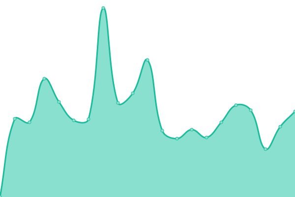
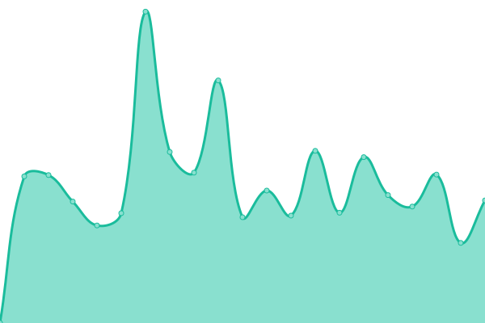

# [📈 Live Status](https://status.mailcow.email): <!--live status--> **🟧 Partial outage**

This repository contains the open-source uptime monitor and status page for [mailcow](mailcow.email), powered by [Upptime](https://github.com/upptime/upptime).

With [Upptime](https://upptime.js.org), you can get your own unlimited and free uptime monitor and status page, powered entirely by a GitHub repository. We use [Issues](https://github.com/mailcow/service-monitoring/issues) as incident reports, [Actions](https://github.com/mailcow/service-monitoring/actions) as uptime monitors, and [Pages](https://status.mailcow.email) for the status page.

<!--start: status pages-->
<!-- This summary is generated by Upptime (https://github.com/upptime/upptime) -->
<!-- Do not edit this manually, your changes will be overwritten -->
<!-- prettier-ignore -->
| URL | Status | History | Response Time | Uptime |
| --- | ------ | ------- | ------------- | ------ |
|  [mailcow Blog](https://mailcow.email) | 🟩 Up | [mailcow-blog.yml](https://github.com/mailcow/service-monitoring/commits/HEAD/history/mailcow-blog.yml) | 

 224ms
     
 | 

<a href="https://status.mailcow.email/history/mailcow-blog">100.00%</a>
    

|  [✅ Stable Demo](https://demo.mailcow.email) | 🟥 Down | [stable-demo.yml](https://github.com/mailcow/service-monitoring/commits/HEAD/history/stable-demo.yml) | 

 932ms
     
 | 

<a href="https://status.mailcow.email/history/stable-demo">99.96%</a>
    

|  [🛠️ Nightly Demo](https://nightly-demo.mailcow.email) | 🟥 Down | [nightly-demo.yml](https://github.com/mailcow/service-monitoring/commits/HEAD/history/nightly-demo.yml) | 

 962ms
     
 | 

<a href="https://status.mailcow.email/history/nightly-demo">99.45%</a>
    

|  [🗑️ Fuzzy Storage](http://fuzzy.mailcow.email/bad-subject-regex.txt) | 🟩 Up | [fuzzy-storage.yml](https://github.com/mailcow/service-monitoring/commits/HEAD/history/fuzzy-storage.yml) | 

 156ms
     
 | 

<a href="https://status.mailcow.email/history/fuzzy-storage">100.00%</a>
    

|  [📡 Spamhaus DQS ASN Checker](https://asn-check.mailcow.email) | 🟩 Up | [spamhaus-dqs-asn-checker.yml](https://github.com/mailcow/service-monitoring/commits/HEAD/history/spamhaus-dqs-asn-checker.yml) | 

 397ms
     
 | 

<a href="https://status.mailcow.email/history/spamhaus-dqs-asn-checker">96.80%</a>
    

<!--end: status pages-->

[**Visit our status website →**](https://status.mailcow.email)

## 📄 License

- Powered by: [Upptime](https://github.com/upptime/upptime)
- Code: [MIT](./LICENSE) © [Anand Chowdhary](https://anandchowdhary.com), supported by [Pabio](https://pabio.com)
- Data in the `./history` directory: [Open Database License](https://opendatacommons.org/licenses/odbl/1-0/)
